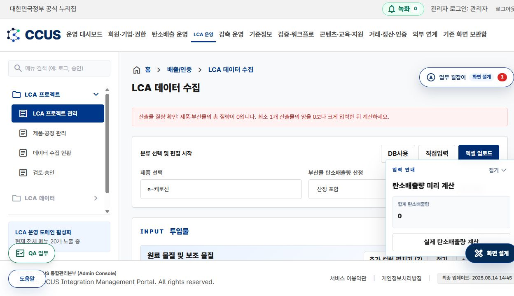

# LCA 계산 입력량 예방 검증 — 설계 및 시험 기록

- 일시: 2026-09-07 10:29~10:35 KST, 약 6분.
- 대상: http://172.16.1.232/admin/emission/survey-admin
- 원씽: 비어 있는 양을 0으로 간주해 리포트로 넘어가지 않도록 계산 진입을 차단한다.
- 적용: /opt/Resonance의 현행 소스, Vite 즉시 반영. 서비스 재시작·빌드·배포·DB 스키마 변경 없음.

## 1. 검증 설계

| 조건 | 동작 | 사용자 조치 |
|---|---|---|
| 빈 문자열 또는 공백 | 계산 차단, 누락 행 수와 최대 5개 위치 표시 | 실제 양 입력 |
| 음수, 숫자 아닌 값, 무한대 | 계산 차단 | 유한한 0 이상 숫자 입력 |
| 사용하지 않는 항목의 명시적 0 | 허용 | 임의로 1을 자동 입력하지 않음 |
| 제품·부산물 총 질량 0 또는 산출물 없음 | 계산 차단 | 최소 1개 양수 산출물 입력 |
| 정상 양·산출물 질량 | 기존 계산 로직 실행 | 기존 합계 유지 |

오류 행이 속한 섹션을 자동으로 펼치며, 경고 영역을 화면 안으로 이동시키고 키보드 포커스를 전달한다. 알림에는 role=alert를 사용한다. 기존 KRDS PageStatusNotice를 재사용한다. 두 실제 계산 버튼은 기존 공통 계산 핸들러의 동일 검증을 거친다. 입력값 자동 변경/자동 저장은 없다.

## 2. 코드와 복구

- 화면: /opt/Resonance/projects/carbonet-frontend/source/src/features/emission-survey-admin/EmissionSurveyAdminMigrationPage.tsx
- 순수 검증 함수: 같은 폴더 surveyAmountValidation.ts
- 자동 시험: /opt/Resonance/projects/carbonet-frontend/source/scripts/test-survey-amount-validation.mjs
- 변경 전 소스: /opt/resonance-data/backups/survey-amount-guard-20260907/EmissionSurveyAdminMigrationPage.before.tsx

복구 시 현행 파일의 추가 변경 여부를 먼저 비교한 후 이번 검증 import·계산 진입 검증·오류 영역 변경만 선택 복원한다. 오래된 페이지 전체를 무조건 덮어쓰지 않는다. 신규 함수와 시험은 다른 참조가 없는지 확인한 뒤 처리한다. DB 복구는 필요 없다.

## 3. 시험 기록

자동시험 명령: `cd /opt/Resonance/projects/carbonet-frontend/source && node scripts/test-survey-amount-validation.mjs`

빈값, 공백, 음수, 비숫자, Infinity, 산출물 0, 산출물 없음, 빈 목록, 명시적 0, 정상 1, 소수, 천단위 구분 — 12/12 PASS. 각 시험에서 입력 배열 변경 없음도 확인했다.

실제 사용자 관리자 세션으로 다음 순서 진행:

1. 공통 e-케로신 데이터 불러오기 → 19개 양 공란.
2. 실제 계산 클릭 → 입력량 확인 19개 안내, 기존 페이지 유지, 공란 보존.
3. 19개 양에 0 입력 → 산출물 질량 0 안내, 리포트 이동 차단, 안내문 자동 스크롤/포커스 시각 확인.
4. 19개 양에 원본 재현 값 1 입력 → 정상 리포트 이동, 79,262.293968 kg CO2e 재현.
5. 입력 데이터 저장/신규 인증서 발급은 이번 예방 시험에서 수행하지 않음.

전체 TypeScript 검사: TaskQuestPanel.tsx:4413의 기존 ScreenWorkContext.source 누락 오류 1건으로 실패. 이번 수정 파일의 오류는 출력되지 않았지만 전체 타입 검사를 PASS로 기록하지 않는다. 기존 업무 길잡이 타입 문제는 이 작업 범위에서 변경하지 않았다.

## 4. 실제 화면

## 5. 범위와 후속 사항

이 검증은 설문 화면에서 정상 계산으로 진입할 때의 프런트엔드 예방 기능이다. 서버 발급 API의 독립적인 입력 검증이나 전체 LCA 승인 절차의 완전성을 보장하는 보안 검증은 아니다. 계산 규칙이나 물질별 물리 단위를 변경하지 않았다.

화면 경고는 현행 KRDS 공통 컴포넌트로 적용했다. 전체 업무 프로세스 정의와 업무 길잡이의 미연결 메타데이터는 승인된 정의를 자동 재생성하지 말라는 현행 소스 정책에 따라 임의 재작성하지 않았다. 이번 설계·QA 근거는 본 문서에 기록한다.

다음 원씽: 별도 작업으로 기존 업무 길잡이 타입 오류와 화면 메타데이터 미연결을 확인하되 승인된 프로세스 경로를 바꾸지 않는다.
