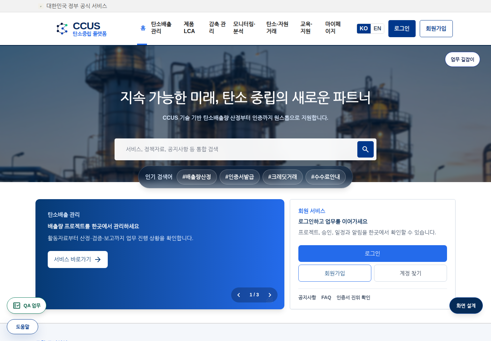

# 현재 버전 보존 및 과거 배포본 폐기

2026-09-08 약2분. 사용자 지시: 현재 버전이 있으면 과거 버전 삭제. 이번 적용 범위는 사전에 설명한 과거 프런트엔드 배포폴더1개로 제한.

삭제 /opt/Resonance/runtime/platform-data/control-plane/source/projects/carbonet-assets/static/react-app. 12,995파일393,893,128bytes(파일합375.65MiB), 삭제전du약402MiB. control-plane/source 전체약1.2GiB→747MiB.

현재 frontend source/package.json과 정규정적자원 디렉터리존재, backend/frontend서비스active확인. 지난 설정검색과이번lsof,외부symlink,실경로,내부symlink없음,hardlink1,삭제직전inode/크기/mtime재검증. 현재소스·운영runtime·DB·모델·P006및과거복사본의다른소스유지. 과거배포파일정확한복원수단은이번작업에없음.

검증: 서비스5개active. 홈브라우저HTTP200/제목CCUS/pageerror0. 스크린샷에서헤더/검색/업무길잡이/QA/화면설계표시확인. 로그인/PDF/P006전체E2E미수행. 서비스재시작0회.

원씽: 현재버전을확인하고실행에서분리된과거배포본만삭제한다. 향후에도현재소스가존재한다는이유만으로DB/사용모델/고유업무데이터까지삭제범위를넓히지않는다.
운영: http://172.16.1.232/home
