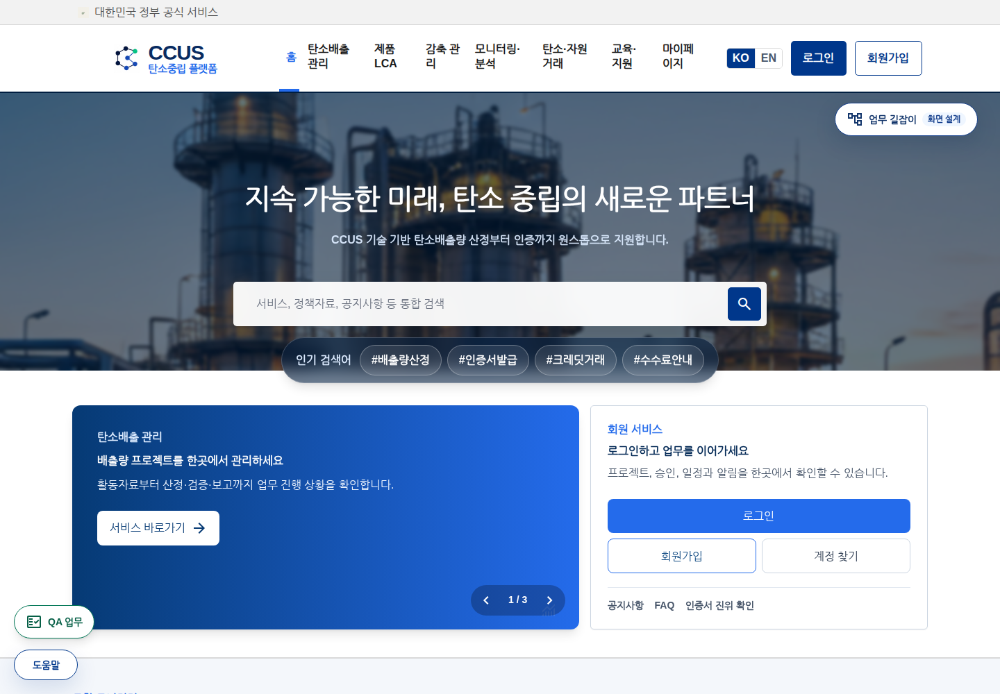
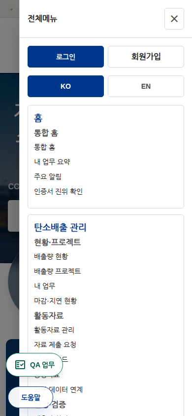

# CCUS /opt/Resonance 단일화 1차 적용 결과

## 적용 범위
2026-09-06, 사용자가 승인한 '현재 동작하는 certificate-verification 소스 우선, 기준 폴더 고유 수정 보존' 원칙으로 진행했다.

1. 비교 계획의 소스 변경 3,454개를 /opt/Resonance에 적용했다.
2. 기준 폴더에만 있는 비교 항목 6,062개를 보존했다.
3. 운영 스크립트·DB 마이그레이션·실제 데이터·공유 정적 자산 등 1,065개는 일괄 복사 대상에서 제외했다. 이 중 실제 프록시 실행 파일과 관련 서비스 설정은 별도 검토·백업 후 아래와 같이 전환했다. 전체 잔여 항목을 완료한 것은 아니다.
4. 기존 업무 데이터와 DB 스키마는 변경하지 않았다.

## 실제 실행 연결
| 대상 | 현재 경로/상태 |
|---|---|
| 개발 프론트 소스 | /opt/Resonance/projects/carbonet-frontend/source |
| 개발 프론트 서비스 | carbonet-frontend-fast-dev, 5175, 위 소스를 직접 실행 |
| 프록시 소스 | /opt/Resonance/ops/runtime/ccus-dev-proxy.mjs |
| 프록시 서비스 | carbonet-dev-proxy, 예전 작업 폴더에서 파일을 복사하는 ExecStartPre 제거 |
| 검증된 최신 프론트 빌드 | /opt/Resonance/runtime/frontend-current 심볼릭 링크 |
| 기존 백엔드 실행 | /opt/resonance-data/dev-runtime/certificate-verification/backend/runtime, 변경하지 않음 |
| 기존 자동 설계 동기화 | carbonet-dev-design-sync.timer disabled/inactive |
| 프록시 자동 설계 실행 | 기본 비활성화 |

서비스 이름과 일부 내부 Carbonet 식별자는 아직 남아 있다. CCUS 전체 명칭 변경까지 완료했다는 의미가 아니다.
프록시의 수동 회원 QA 실행 경로에는 이전 작업 폴더 참조가 남아 있으며, 해당 QA 도구·의존성 이관은 후속 검토 대상이다. 자동 실행은 중지했다.

## 무빌드와 빌드의 구분
- 현재 개발 프론트는 /opt/Resonance 소스를 Vite로 직접 읽는다. 지원되는 프론트 변경은 소스 저장 후 개발 서버에 반영된다.
- 기존 SDUI·테마·공통 컴포넌트 구조는 유지했다. 전체 화면을 새 SDUI 구조로 변환한 작업은 아니다.
- Java·공통 렌더러 등 엔진 변경은 여전히 빌드·호환성 검증이 필요하다.

## 빌드 중 변경 누락 방지
명령:
```bash
cd /opt/Resonance/projects/carbonet-frontend/source
npm run build
```
현재 명령은 다음을 순서대로 수행한다.
1. /opt/Resonance 원본 및 실행 서비스 경로 확인
2. 이전 자동 동기화 타이머 비활성 확인
3. 프론트 소스·공개 자산·의존성 설정 해시 기록
4. TypeScript 검사, 독립 후보 폴더 빌드
5. 빌드 전후 원본 해시 동일성 확인
6. 임시 후보 서버에서 메뉴·폰트·모바일 브라우저 검사
7. 브라우저 검사 종료 시 원본 해시 재확인
8. 통과한 후보만 runtime/frontend-current로 지정

predev/prebuild에서 임의 설계 생성기를 실행하지 않도록 분리했다. 설계 생성 명령은 남겨 두었으나 승인된 설계 변경 작업에서 별도로 실행해야 한다.
이 보호는 새 표준 npm 명령에 적용된다. Vite 직접 실행, 과거 운영 배포 스크립트 등 모든 우회 경로를 차단한 상태는 아니다.

## 검사 결과
- 통합 프론트 TypeScript 검사 PASS.
- 기존 위임·승계 페이지는 존재하지만 라우트 등록이 없던 항목을 보완. 기존 URL /work/company-manager-delegation을 기존 페이지 컴포넌트에 연결.
- 프론트 후보 빌드 PASS: 첫 후보 27.16초, 표준 명령 내 빌드 25.72초.
- 표준 npm 빌드 전체 단계 PASS: 80초. 1분 이내 목표는 아직 미달.
- 백엔드 Java 컴파일 PASS: 17초. 실행 중인 백엔드를 이 결과로 교체하지는 않음.
- 실제 http://172.16.1.232 홈: 메뉴 API 8개, DOM 8개, 아이콘 폰트 정상, 검사 구간 홈 요청 2회, 검사 실패 0개.
- PC 1440px 및 모바일 390px 시각 확인. 모바일 메뉴 열기 PASS.
- /tmp에서 원본 검사 실행 시 기대대로 차단됨.
- 백엔드 health: UP. 이것은 PDF·전체 업무 E2E 통과 증거가 아님.
- 관리자 대시보드 레이아웃과 메뉴 DOM 확인. 관리자 인증 완료 증거로 취급하지 않음.
- PDF 발급 화면: 관리자 로그인으로 이동. 다운로드·진위 검증 E2E는 로그인 후 추가 확인 필요.

## 복구 자료
서버: /opt/resonance-data/backups/ccus-unification-20260906
- canonical-changed-source.tar.gz: 비교 대상 원본 8,684개 파일
- active-changed-source.tar.gz: 비교 대상 작업본 4,454개 파일
- source-merge-plan.json, conflict-review.json, source-merge-applied.json
- frontend-before.service, proxy-before.service, proxy-before.mjs
- source-gate.json, wrong-root-test.json, header-verification.json
- backend-compile.log, npm-build-current.log

위 소스 압축은 전체 DB·전체 서버 백업이 아니다. 기존 미커밋 수정도 보존했으며 git reset/checkout으로 되돌리지 않았다.

## 증거 이미지



## 아직 하지 않은 것
- 운영 백엔드 실행 경로 이관 및 DB 분리·이름 변경
- 모든 잔여 운영 스크립트·정적 자산·마이그레이션의 단일화
- 페이지별 복구 패키지 자동 생성 및 커밋별 미리보기 서비스
- 과거 빌드 삭제, 기존 전달 압축본 교체
- 모든 페이지·액터·프로세스의 인증된 E2E 검사

원씽: 수정 원본과 실행 원본을 일치시키고 해시로 확인한다.
깨달음: 소스 통합·컴파일·실제 업무 검증은 서로 다른 완료 조건이다.
다음 바위: 관리자 로그인 후 PDF 발급·진위 검증 → 잔여 운영 경로 이관 → 페이지별 복구 패키지·미리보기 자동화 → 보존 정책에 따른 비활성 빌드 정리.
