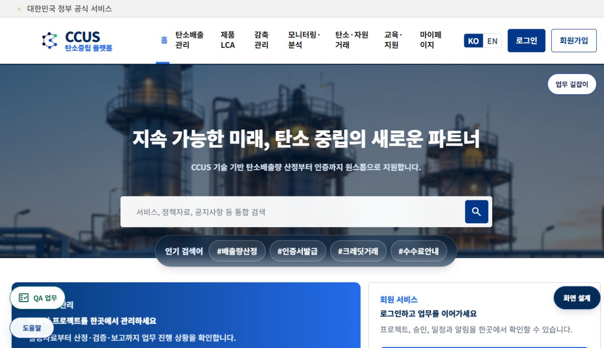
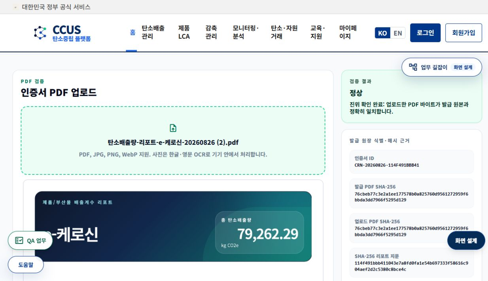
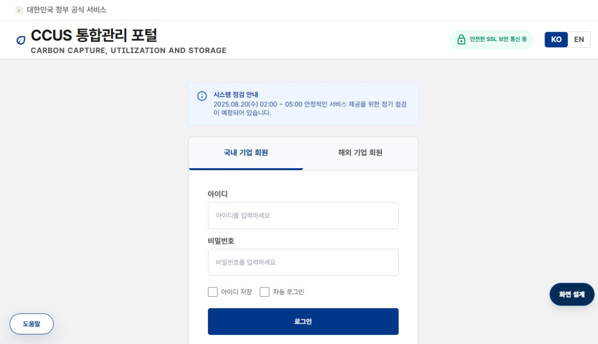
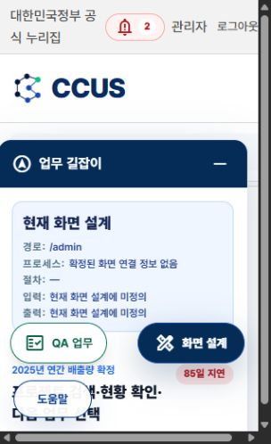
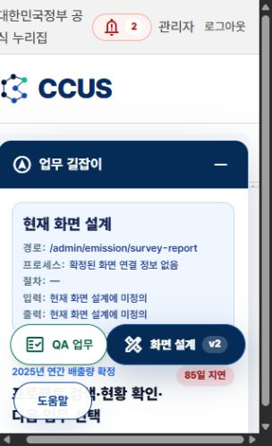
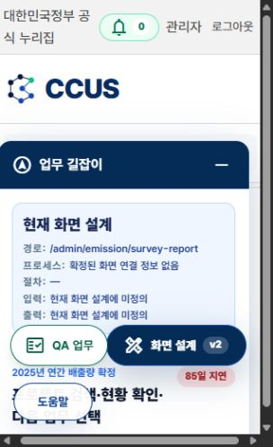
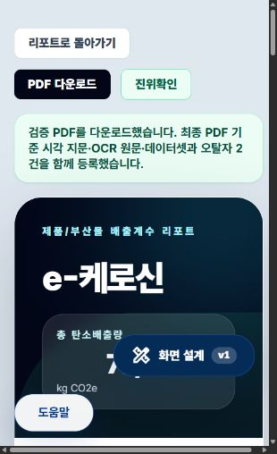
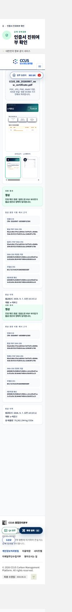

# CCUS 운영 DB 전환 완료 — 설계·검증 기록 — 2026-09-07

## 1. 목적과 범위

웹앱의 주 데이터베이스 `carbonet`을 Kubernetes PostgreSQL 16.3에서 `/opt/ccus-postgresql16`의 독립 PostgreSQL 16.15로 이전한다. 소스코드·화면·메뉴·사용자 권한은 변경하지 않는다. 개발 DB 35432와 다른 프로젝트 DB는 이번 전환 범위에 포함하지 않는다.

사용자는 2026-09-07 최대 60분 서비스 중단을 승인했다. 전체 작업 시작은 09:10:59 KST이며, 인덱스 불일치 복구 후 최종 재시도는 09:34:19에 시작했다.

## 2. 이전 시도의 실패와 확인된 원인

2026-09-06 시도는 23분 15초 후 자동 롤백됐다. `framework_contract_completion_run`의 원본 인덱스 기반 조회 9,122행과 복원본 9,123행이 달랐다. 2026-09-07 09:10:59 시도 역시 20분 47초 후 같은 차이로 자동 롤백됐다.

추가 조사 결과 원본에서 기본키 Index Only Scan은 9,122행, 강제 Seq Scan은 9,123행을 반환했다. ID 1454는 2026-07-23 20:53:27의 기존 이력이었다. 복원 과정에서 새 행이 생성된 것이 아니다. 원본 기본키 인덱스의 조회 불일치가 원인이다. 물리적 발생 원인(장비/이전 운영 등)은 확인하지 않았다.

`REINDEX INDEX public.framework_contract_completion_run_pkey` 후 인덱스 기반 조회도 9,123행과 ID 1454를 정상 반환했다. 데이터 행은 삭제하지 않았다. 이후 모든 행 수 검증은 `enable_indexscan=off`, `enable_indexonlyscan=off`, `enable_bitmapscan=off`로 실제 테이블을 읽는다. 원본과 복원본의 SELECT 실행 계획 차이를 동일한 검증 조건으로 통제한다.

이번에는 기존 방식에 다음을 추가했다.

1. 418개 public 테이블에 SHARE 잠금을 유지하는 전용 트랜잭션을 만든다. 일반 읽기와 pg_dump는 허용하고 테이블 DML·충돌 DDL은 차단한다.
2. 백업 전·후 정확한 행 수를 비교한다.
3. 복원 후 테이블별 행 수를 원본과 비교한다.
4. 전환 전에 잠금 세션 생존을 확인한다.
5. 구 DB의 신규 연결을 차단하고 남은 연결을 종료한 후 신규 DB로 연결한다. 구 DB 데이터·볼륨은 삭제하지 않는다.

잠금 획득 제한 60초, 유지 상한 55분. 실패 시 구 DB 연결 허용·readonly 해제·기존 백엔드 및 중지 타이머 복원을 시도한다. 실패 복구 후 health를 별도 확인해야 한다.

## 3. 구성

| 구분 | 위치 / 값 |
|---|---|
| 소스 | `/opt/Resonance` |
| 웹 주소 | [CCUS 홈](http://172.16.1.232/home) |
| 운영 별칭 | [production](https://production.172.16.1.232.nip.io/home) |
| 신규 DB | `127.0.0.1:35433/carbonet` |
| 신규 DB 파일 | `/opt/ccus-postgresql16/data` |
| 신규 DB 서비스 | `ccus-postgresql-native.service` |
| 백엔드 | `carbonet-production-direct.service`, 18080 |
| 연결 override | `/etc/systemd/system/carbonet-production-direct.service.d/99-native-db.conf` |
| 최종 백업·증거 | `/opt/resonance-data/backups/native-final-20260907-093419` |
| 실패 분석 증거 | `/opt/resonance-data/backups/native-final-20260907-091059` |
| 작업 로그 | `journalctl -u ccus-native-db-cutover-v3` |

기존 내부 DB명/서비스명을 이번 이전 과정에서 바꾸지 않는다. 화면 브랜드는 CCUS다. 비밀번호·키·globals.sql은 설계서나 Git/일반 배포물에 포함하지 않는다.

## 4. 검증 순서

| 순서 | 입력 / 행위 | 통과 조건 | 상태 |
|---|---|---|---|
| 1 | 원본 테이블 잠금 | 418개 ShareLock 확보 | 재시도에서 재확인 |
| 2 | 최종 논리 백업 | dump 완료, SHA256 기록 | 6,222,232,529바이트, SHA256 재검증 OK |
| 3 | 백업 전후 행 수 | 모든 테이블 일치 | Seq Scan 기준 전체 일치 |
| 4 | 신규 DB 전체 복원 | pg_restore exit 0 | 09:48:55 시작, 오류 없이 완료 |
| 5 | 복원 행 수·인덱스 | 행 수 전체 일치, 무효 인덱스 0 | 09:56:41 전체 일치. 문제 기본키 amcheck heapallindexed 검사도 통과 |
| 6 | 객체·제약·시퀀스 비교 | 원본 검증 목록 2,917줄과 비교 | 구조 일치, 시퀀스 127개 역행 없음. 시작 후 2개 증가 |
| 7 | Java 실행 DB | 실제 TCP 35433, health UP | 09:56:49 정상. PID 4106963의 실제 TCP 연결 확인 |
| 8 | 홈·로그인·진위확인 UI | 실제 화면 표시, 스크린샷 | 3개 화면 검수 이미지 저장. 로그인 입력폼 표시 확인 |
| 9 | 기존 PDF 2개 진위검증 | API 유효 결과·바이트 해시 일치 | 정상 2개 EXACT_PDF_MATCH, 변조 1개 TAMPERED_PDF. 8월 26일 원본은 실제 브라우저 업로드 후 정상 판정도 확인 |
| 10 | 실제 관리자 로그인·새 PDF 발급 | 사용자 세션 기반 E2E | 10:23 후속검증 완료. 관리자 인증 유지, 원본 입력 19행 재현, 합계 79,262.2939680902, 새 PDF 발급 및 실제 업로드 정상. 아래 9절 참조 |

API/DB 통과와 실제 로그인·PDF 발급 E2E 통과를 구분한다. 임의 계정 연결·인증 우회·가짜 통과 처리는 하지 않는다.

## 5. 자동화와 Kubernetes 삭제 조건

24개 활성 타이머를 기록하고 중지했다. 구 DB 주소를 참조할 수 있는 자동화는 신규 DB 연결과 권한 검증 전까지 재시작하지 않는다. `carbonet-duckdns-cert-renew.timer`, `carbonet-patroni-auto-heal.timer`, `resonance-internal-ca-verify.timer` 3개를 재개했다. 나머지 21개는 중지 상태이며 전체 상태는 증거 폴더의 `timer-final-state.txt`에 보존했다. 타이머를 재개했다고 해서 해당 작업의 다음 실행 결과까지 검증한 것은 아니다.

P004/P005/P006, Redis, Keycloak, Backstage 및 다른 DB 소비자가 남아 있으므로 주 DB 전환 성공만으로 Kubernetes 전체를 삭제하면 안 된다. 후속 작업은 소비자별 이전 목록과 검증 결과를 만든 후 단계적으로 정리하는 것이다.

## 6. 복구 시 주의

전환 전에 실패한 경우 구 DB가 정본이다. 전환 후 신규 DB에 업무 데이터가 기록됐다면 구 DB로 단순 연결 복귀하면 새 데이터가 유실될 수 있다. 그때는 신규 DB 쓰기를 멈추고 백업 및 변경분 이관 계획부터 수립한다. 과거 백업을 자동으로 덮어쓰지 않는다.

## 7. 현재 결과

운영 DB 전환 완료 시각은 09:56:49 KST. 최종 재시도 소요 22분 30초, 첫 시도부터 원인 분석·재시도를 포함한 전환 완료까지 약 45분 50초. 09:56:55에 자동 후속 검증까지 통과했다.

현재 주 DB는 `/opt/ccus-postgresql16/data`이며 localhost 35433만 수신한다. 재부팅 자동 시작을 활성화했다. 실제 재부팅 시험은 하지 않았다. 운영 HTTPS 홈은 인증서 검증을 끄지 않은 curl 요청에서 HTTP 200을 확인했다.

구 `carbonet` DB는 삭제하지 않고 `ALLOW_CONNECTIONS=false`, `default_transaction_read_only=on`, 활성 연결 0개로 보존했다. 현재 업무 DB는 신규 DB이며, 구 DB로 무단 쓰기나 자동 회귀가 발생하지 않도록 차단했다.

서비스 연결 override 실제 파일은 `/opt/Resonance/ops/host-config/systemd/carbonet-production-direct.service.d/99-native-db.conf`에 있고 `/etc`에는 호환 링크만 둔다. 환경파일은 `/opt/ccus-postgresql16/native-db-runtime.env`다.

`/opt/ccus-postgresql16/PRODUCTION_ACTIVE` 보호 표식을 남긴다. 최종 전환 스크립트는 이 표식이 있으면 중단한다. 현재 서비스 중인 신규 DB에 시험 복원 스크립트를 다시 실행하면 안 된다.

관리자 실제 로그인은 사용자 세션으로 확인했다. 홈에서 동일 origin의 /admin과 설문 관리로 이동해도 관리자 인증이 유지됐다. 새 PDF 발급은 설문 계산 결과가 0으로 표시되어 보류했다. 이전 원본 PDF의 79,262.294 kg CO2e와 같은 입력 조건인지 아직 확인되지 않았으며 DB 이관에 의한 손실이라고 단정하지 않는다. 업무 입력값 저장이나 0값 인증서 발급은 수행하지 않았다. 기존 PDF 검증 통과를 새 발급 E2E 통과로 대체하지 않는다. Kubernetes 삭제와 21개 자동화의 새 DB 전환은 아직 수행하지 않았다.

## 8. 실제 화면 증거

### 홈: 상단 메뉴·아이콘·화면 설계·업무 길잡이 버튼

### 인증서 진위확인: 기존 PDF 업로드 후 정상 판정

### 로그인: 입력폼과 로그인 버튼 표시

이번 작업은 DB 연결 이전이므로 기존 화면의 안내 문구나 업무 정의를 임의로 변경하지 않았다.

### 사용자 로그인 후 관리자 접근

### 신규 발급 전 확인 필요: 설문 계산값 0

당시 후속 원씽이었던 입력값 대조와 신규 발급 검증은 아래 9절에서 완료했다. 위 보류 기록은 발견 시점의 이력이다.

## 9. 로그인 이후 실제 신규 발급 후속검증 (2026-09-07)

### 9.1 원인 및 작업 경계

시작 10:13:35 KST, 최종 API 검증 10:23:19 KST. 검증 약 9분 45초(문서 정리 제외).
공통 데이터셋의 양 필드가 비어 있어 숫자 변환 결과 0으로 계산되었다. 원본 발급 원장 CRN-20260826-114F491BBB41의 dataset_json에는 19행의 originalAmount가 각각 1, 단위 t로 남아 있었다. 기존 발급 기록과 현재 공통 입력 템플릿은 같은 객체가 아니다. DB 이전에 따른 입력량 유실이라는 증거는 없으며, 공통 데이터셋을 과거 인증서의 값으로 덮어쓰지 않았다.

이번에는 기존 정상 발급의 입력 조건을 화면 편집기에만 재현했다. 입력 데이터 저장 버튼은 누르지 않았다. 사업상 실제 수량이나 각 물질의 물리적 단위 타당성을 새로 승인한 것이 아니라, 기존 계산의 회귀 재현 시험이다. 재시작·빌드·배포·계산 코드 변경은 0회다.

### 9.2 프로세스 순서별 실제 검증

| 순서 | 계정/액터 | 화면 및 기능 | 입력 | 출력 및 검증 |
|---|---|---|---|---|
| 1 | 사용자가 로그인한 관리자 세션 | /admin → /admin/emission/survey-admin | 동일 http://172.16.1.232 origin | 로그인 유지, 관리자 표시 |
| 2 | 동일 관리자 | 공통 e-케로신 데이터 불러오기 | 기존 데이터셋, 8개 섹션 | 행과 배출계수 표시, 양은 공란 |
| 3 | 동일 관리자 | 화면에서 양 입력 | 원료 5, 에너지 3, 기타 1, 제품 1, 대기 4, 수계 2, 폐기물 3 = 19행 × 1t | 공통 DB 저장 없이 편집 상태만 변경 |
| 4 | 동일 관리자 | 실제 탄소배출량 계산 | 위 19행, 기존 배출계수 | 79,262.2939680902 kg CO2e, 기존 발급 원장 합계 일치 |
| 5 | 동일 관리자 | PDF 출력 → 한글 리포트 PDF → PDF 다운로드 | 생성 리포트 | 10:19:12 신규 인증서 생성, 화면 다운로드 완료 메시지 |
| 6 | native PostgreSQL 읽기 검증 | carbonet_report_verification_registry | 신규 인증서 ID | 원장·해시·503842바이트·원본 저장 경로 확인 |
| 7 | 공개 검증 화면 | /home/certificate-verify | 서버에 저장된 신규 발급 원본을 Downloads로 복사 후 업로드 | 정상, 업로드 바이트가 발급 원본과 정확히 일치 |
| 8 | 공개 API | /api/home/certificate-verify/verify-file | 동일 PDF 및 인증서 ID | EXACT_PDF_MATCH, valid=true, byteHashMatch=true, sizeMatch=true, serverSignatureValid=true, 5/5페이지, visualExactMatch=true, changedRegionCount=0 |

신규 인증서: `CRN-20260907-60500BF62508`
SHA-256: `96adc08e379e2a8936cfe075dfcc0b40e3b4e3b7d31f5d835c6ac2d48d97a78b`
PDF 크기: 503,842바이트. 새 원장 및 PDF 저장은 정상 발급 기능을 통해 이루어졌고 SQL로 발급/서명을 조작하지 않았다.

브라우저 다운로드 완료 메시지는 확인했지만 브라우저 다운로드 파일의 로컬 경로가 노출되지 않아, 제공 PDF는 서버 발급 원본을 별도로 복사한 파일이다. 복사본 해시는 신규 DB 등록 해시와 일치한다.

### 9.3 화면 증거와 결과물

[새 발급 PDF](CCUS_DB_20260907_new_certificate.pdf)

### 9.4 남은 범위 및 예방 설계

이번 검증은 DB 이전 후 계산·발급·진위검증 회귀 시험이다. LCA 업무 원장 화면은 제출/검증/승인 WAIT로 표시됐으므로 업무 승인 프로세스 전체 검증 PASS가 아니다. 좁은 브라우저 패널에서는 부동 도움말/QA/설계 버튼이 본문과 겹치는 현상도 관찰했다. 이번 DB 검증에서 임의 UI 재설계는 하지 않았다.

예방 설계의 다음 원씽은 공통 입력 템플릿과 사용자 저장 수량을 명확히 구분하고, 계산 전에 필수 산출물 질량 누락을 명시적으로 안내하는 것이다. 과거 발급 기록의 값을 새 업무의 기본값으로 자동 덮어쓰면 안 된다. 과거 리포트 재현은 인증서 ID를 지정한 명시적 불러오기 및 변경 이력으로 분리해야 한다. 이는 후속 제안이며 아직 구현했다고 주장하지 않는다.
